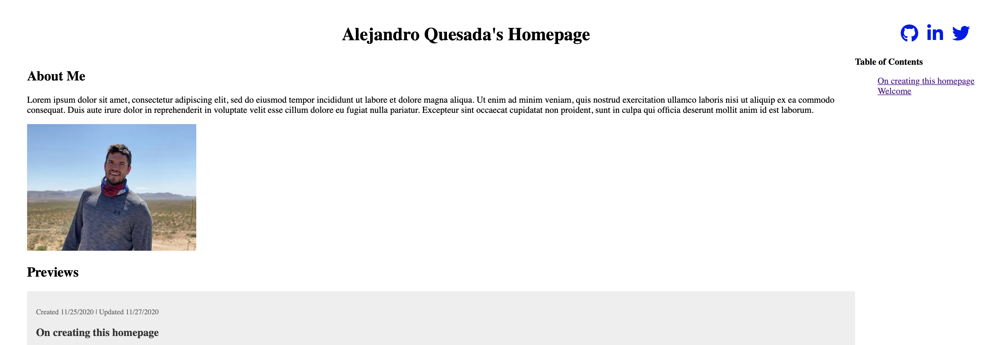

# Alejandro Quesada's Alpha Homepage

## Requirements

- Rust + Cargo
- Node + Yarn (or NPM)

## Getting Started

In root run `make` to build a Web Assembly (WASM) NPM package. WASM is being used in this context for 1) exploration and 2) to parse TOML files (marked as .md for formatting purposes) into static HTML documents statically rendered and hydrated by NextJS a ReactJS server-side framework.

`cd next && yarn && yarn dev` - at this point `http://localhost:3000` should bear the website. 

## Written Contents

I haven't gone as far as actual writing anything for the "blog", but have enjoyed constructing it with Rust, WASM, NextJS, and React. Typescript was not utilized in-order to expedite solo-development for transpilation time and related cognitive overhead. Will I get around to actually creating content? Hopefully 😊! The website is meant to look like a plain HTML document as I actually quite like the simplistic aesthetic for this sort of site.

This is meant to eventually replace https://github.com/alejandroq/terra-incognita.blog which can be found deployed here http://alexq.me which simply proxies to a public S3 item. The infrastructure will be improved this go around. 